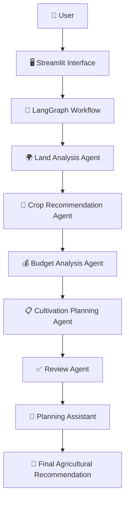
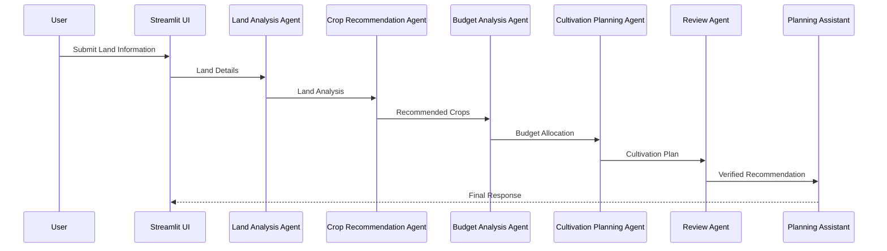
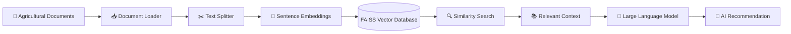

# 🌾 Agriculture Land Planning Agent

<p align="center">


</p>

---

# 🌱 Agriculture Land Planning Agent

> **An AI-powered Multi-Agent Agricultural Decision Support System using LangGraph, Retrieval-Augmented Generation (RAG), and Large Language Models (LLMs).**

The **Agriculture Land Planning Agent** is an intelligent decision-support system developed to assist farmers in generating optimized agricultural land cultivation plans. The application leverages **Agentic AI**, where multiple specialized AI agents collaborate to analyze land conditions, recommend suitable crops, allocate budgets, and generate comprehensive cultivation plans.

Unlike traditional AI chatbots that rely on a single prompt, this system follows a **multi-agent architecture** implemented with **LangGraph**, enabling each agent to focus on a dedicated agricultural planning task. Additionally, the system integrates **Retrieval-Augmented Generation (RAG)** to improve response quality by retrieving relevant agricultural knowledge from a curated document repository before generating recommendations.

The application provides a user-friendly **Streamlit** interface where farmers or agricultural planners can enter land details and receive intelligent planning recommendations supported by AI reasoning and domain knowledge.

---

# 📑 Table of Contents

- [Project Overview](#-project-overview)
- [Project Objectives](#-project-objectives)
- [Key Features](#-key-features)
- [System Architecture](#-system-architecture)
- [Agent Communication](#-agent-communication)
- [RAG Pipeline](#-rag-pipeline)
- [Model Choice Comparison](#-model-choice-comparison)
- [Technology Stack](#-technology-stack)
- [Project Structure](#-project-structure)
- [Installation Guide](#-installation-guide)
- [Environment Variables](#-environment-variables)
- [Running the Application](#-running-the-application)
- [Example Usage](#-example-usage)
- [Screenshots](#-screenshots)
- [Live Streamlit Demo](#-live-streamlit-demo)
- [Known Limitations](#-known-limitations)
- [Future Improvements](#-future-improvements)
- [Author](#-author)
- [License](#-license)

---

# 📖 Project Overview

Agricultural land planning involves multiple factors including land size, geographical location, available budget, irrigation methods, soil characteristics, and cultivation objectives. Farmers often rely on personal experience or fragmented information sources when making cultivation decisions.

This project addresses this challenge by combining **Large Language Models (LLMs)** with **Retrieval-Augmented Generation (RAG)** and a **multi-agent architecture** to automate agricultural planning.

Instead of producing generic responses, the system retrieves relevant agricultural knowledge from its document repository and coordinates multiple AI agents to generate informed recommendations.

The generated output includes:

- Land suitability analysis
- Crop recommendations
- Budget allocation suggestions
- Cultivation planning
- AI-generated review and recommendations

---

# 🎯 Project Objectives

The primary objectives of this project are:

- Develop an AI-powered agricultural decision support system.
- Demonstrate Agentic AI using LangGraph.
- Implement multiple collaborative AI agents.
- Improve recommendation quality using Retrieval-Augmented Generation (RAG).
- Store agricultural knowledge in a FAISS vector database.
- Generate intelligent cultivation plans based on user requirements.
- Provide a simple and interactive Streamlit web application.

---

# ✨ Key Features

### 🤖 Multi-Agent AI Workflow

The planning process is divided into multiple intelligent agents that perform specialized tasks.

---

### 🧠 Retrieval-Augmented Generation (RAG)

Relevant agricultural documents are retrieved before the language model generates recommendations.

---

### 🌾 Land Analysis

Analyzes user-provided land information and determines agricultural suitability.

---

### 🌱 Crop Recommendation

Suggests suitable crops based on district, soil type, water source, and cultivation objectives.

---

### 💰 Budget Planning

Distributes the available budget among recommended cultivation activities.

---

### 📋 Cultivation Planning

Generates a structured agricultural cultivation plan.

---

### ✅ AI Review Agent

Reviews outputs produced by previous agents and improves the final recommendation.

---

### 🌐 Streamlit Interface

Provides an easy-to-use web interface for interacting with the AI planning system.

---

# 🏗️ System Architecture



---

## 🏛️ Architecture Explanation

The application follows a **multi-agent architecture** where each AI agent is responsible for a specific planning task.

Instead of asking a single language model to generate the entire response, the planning workflow is divided into smaller reasoning steps. This improves modularity, maintainability, and response quality.

The **LangGraph** framework orchestrates communication between agents and manages the workflow state throughout the planning process.

Each agent receives the output generated by the previous agent, performs its assigned task, and forwards the updated information to the next stage until the final recommendation is produced.

---

# 🤖 Agent Communication

The Agriculture Land Planning Agent follows a sequential multi-agent communication workflow coordinated using **LangGraph**. Each agent performs a dedicated task and passes its output to the next agent through a shared state.



## 🔄 Agent Responsibilities

| Agent | Responsibility |
|--------|----------------|
| 🌍 Land Analysis Agent | Evaluates land information and agricultural suitability. |
| 🌱 Crop Recommendation Agent | Identifies crops suitable for the provided conditions. |
| 💰 Budget Analysis Agent | Allocates the available budget across cultivation activities. |
| 📋 Cultivation Planning Agent | Generates the cultivation strategy. |
| ✅ Review Agent | Reviews and validates the generated plan. |
| 🤖 Planning Assistant | Produces the final AI response for the user. |

---

# 🧠 Retrieval-Augmented Generation (RAG)

To improve response quality and reduce hallucinations, the application uses **Retrieval-Augmented Generation (RAG)**.

Instead of relying only on an LLM's pretrained knowledge, the system retrieves relevant agricultural information from a curated knowledge base before generating the final response.

## 🔍 RAG Workflow



---

## 📚 Knowledge Base

The RAG knowledge base contains agricultural reference documents such as:

- Sri Lankan district information
- Crop suitability guides
- Cultivation budget guides
- Agricultural planning guides
- Farming best practices

These documents are indexed into a **FAISS Vector Store**, allowing the system to retrieve only the most relevant information for each query.

---

## ⚙️ RAG Processing Steps

1. Agricultural documents are loaded.
2. Documents are divided into smaller text chunks.
3. Sentence embeddings are generated.
4. Embeddings are stored inside the FAISS vector database.
5. The retriever performs semantic similarity search.
6. Relevant document chunks are provided as context to the LLM.
7. The LLM generates a grounded recommendation.

---

# 🤖 Model Choice Comparison

The project supports multiple Large Language Models.

| Model | Purpose | Advantages | Limitations |
|--------|----------|------------|-------------|
| **Groq – Llama 3.1 8B Instant** | Primary reasoning model | Very fast inference, low latency, cost-effective | Internet connection required |
| **OpenRouter – Nemotron** | Alternative reasoning model | Flexible model selection, fallback support | API response time depends on provider |

---

## 🏆 Why Groq?

- Fast response generation
- Low latency
- Suitable for interactive applications
- Excellent performance for Agentic AI workflows

---

## 🌐 Why OpenRouter?

- Access to multiple LLM providers
- Flexible deployment options
- Useful as a fallback model
- Easy integration with LangChain

---

# 🛠️ Technology Stack

| Category | Technology |
|-----------|------------|
| Programming Language | Python |
| User Interface | Streamlit |
| Multi-Agent Framework | LangGraph |
| LLM Framework | LangChain |
| Vector Database | FAISS |
| Embedding Model | Sentence Transformers |
| Primary LLM | Groq |
| Alternative LLM | OpenRouter |
| Environment Management | python-dotenv |

---

# 📂 Project Structure

```text
Agriculture-Land-Planning-Agent
│
├── agents/
│   ├── land_analysis.py
│   ├── crop_recommendation.py
│   ├── budget_analysis.py
│   ├── cultivation_plan.py
│   ├── review.py
│   └── planning_assistant.py
│
├── graph/
│   └── workflow.py
│
├── rag/
│   ├── data/
│   ├── loader.py
│   ├── splitter.py
│   ├── embeddings.py
│   ├── vector_store.py
│   ├── retriever.py
│   └── rag_service.py
│
├── tools/
│   └── llm.py
│
├── ui/
│
├── app.py
├── requirements.txt
├── README.md
└── .env
```

---

# 💡 Why LangGraph?

LangGraph provides a structured way to build multi-agent AI systems.

Key benefits include:

- Stateful workflows
- Modular agent design
- Agent-to-agent communication
- Easy workflow expansion
- Better maintainability
- Flexible execution control

---

# 💡 Why Retrieval-Augmented Generation (RAG)?

Traditional LLMs rely only on pretrained knowledge.

RAG improves the system by:

- Retrieving relevant agricultural documents
- Reducing hallucinations
- Improving recommendation accuracy
- Providing domain-specific context
- Supporting knowledge updates without retraining the LLM

---

# 🚀 Installation Guide

Follow the steps below to set up and run the project locally.

## 1️⃣ Clone the Repository

```bash
git clone https://github.com/dilumgit/Agriculture-Land-Planning-Agent.git
```

Move into the project directory.

```bash
cd Agriculture-Land-Planning-Agent
```

---

## 2️⃣ Create a Virtual Environment

```bash
python -m venv venv
```

---

## 3️⃣ Activate the Virtual Environment

### Windows

```bash
venv\Scripts\activate
```

### Linux / macOS

```bash
source venv/bin/activate
```

---

## 4️⃣ Install Required Packages

```bash
pip install -r requirements.txt
```

---

## 5️⃣ Configure Environment Variables

Create a `.env` file in the project root.

```env
GROQ_API_KEY=YOUR_GROQ_API_KEY

OPENROUTER_API_KEY=YOUR_OPENROUTER_API_KEY
```

> **Note:** Replace the placeholder values with your own API keys.

---

## 6️⃣ Build the RAG Knowledge Base

If your project requires generating the FAISS vector database, run:

```bash
python rag/build_vector_db.py
```

> This step only needs to be performed when the knowledge base is updated.

---

## 7️⃣ Run the Application

```bash
streamlit run app.py
```

The application will be available at:

```
http://localhost:8501
```

---

# ▶️ Running the Application

After launching the application:

1. Open the Streamlit interface.
2. Enter the required agricultural information.
3. Submit the form.
4. The AI agents execute sequentially.
5. Relevant agricultural documents are retrieved from the RAG knowledge base.
6. The final cultivation recommendation is generated and displayed.

---

# 📖 Example Usage

## Example Input

| Parameter | Example |
|------------|---------|
| District | Kurunegala |
| Land Size | 2 Acres |
| Budget | Rs. 500,000 |
| Water Source | Well |
| Soil Type | Loamy |
| Objective | Maximum Profit |

---

## Expected Output

The system generates:

- 🌍 Land Suitability Analysis
- 🌱 Recommended Crops
- 💰 Budget Allocation
- 📅 Cultivation Plan
- ✅ AI Review
- 📄 Final Agricultural Recommendation

---

# 📸 Screenshots

The following screenshots should be added after completing the application.

## 🖥️ Home Page

```
screenshots/home.png
```

*(Insert screenshot here)*

---

## 📝 User Input Form

```
screenshots/input_form.png
```

*(Insert screenshot here)*

---

## 🤖 AI Recommendation

```
screenshots/results.png
```

*(Insert screenshot here)*

---

## 📚 RAG Knowledge Base

```
screenshots/rag.png
```

*(Insert screenshot here)*

---

## 📂 GitHub Repository

```
screenshots/github.png
```

*(Insert screenshot here)*

---

# 🎥 Demo Video

Record a short demonstration showing:

- Project introduction
- GitHub repository
- Running the application
- User input
- AI workflow
- Generated recommendation
- RAG functionality

## Demo Video Link

> *(Add your YouTube or Google Drive link here)*

---

# 🌐 Live Streamlit Demo

Deploy the application using **Streamlit Community Cloud**.

### Live Application

> *(Add your deployed Streamlit URL here)*

Example

```
https://your-project.streamlit.app
```

---

# 📂 GitHub Repository

GitHub Repository:

```
https://github.com/dilumgit/Agriculture-Land-Planning-Agent
```

---

# ✅ Assignment Requirements Checklist

| Requirement | Status |
|------------|--------|
| Project Description | ✅ Included |
| Architecture Diagram | ✅ Included |
| Agent Communication Diagram | ✅ Included |
| RAG Pipeline Explanation | ✅ Included |
| Model Comparison Table | ✅ Included |
| Setup Instructions | ✅ Included |
| Streamlit Demo Link | ✅ Placeholder Added |
| Screenshots | ✅ Placeholder Added |
| Demo Video | ✅ Placeholder Added |
| Known Limitations | ⏳ Included in Part 4 |
| Future Improvements | ⏳ Included in Part 4 |
| License | ⏳ Included in Part 4 |
| Author | ⏳ Included in Part 4 |

---

# 💡 Tips for Evaluation

To achieve the best presentation during evaluation:

- Ensure the RAG knowledge base is built before running the application.
- Demonstrate each AI agent in sequence.
- Show that retrieved document context influences the generated recommendation.
- Include screenshots in the README after testing.
- Provide a working Streamlit deployment link before submission.
- Verify that all GitHub links are publicly accessible.

---

# ⚠️ Known Limitations

Although the Agriculture Land Planning Agent provides intelligent recommendations, the current implementation has several limitations:

- The quality of recommendations depends on the documents available in the RAG knowledge base.
- Real-time weather conditions are not considered during decision-making.
- Live market prices and crop demand are not integrated.
- The system currently focuses on agricultural planning and does not estimate long-term profitability.
- Internet connectivity is required to access external LLM APIs.
- AI-generated recommendations should be validated by agricultural experts before practical implementation.

---

# 🚀 Future Improvements

The following enhancements can further improve the system:

## 🌦️ Weather Integration

Integrate weather APIs to provide weather-aware cultivation recommendations.

---

## 💹 Market Price Prediction

Recommend crops using current and predicted market prices.

---

## 📱 Mobile Application

Develop Android and iOS applications for easier farmer access.

---

## 🌍 Multi-Language Support

Support:

- English
- Sinhala
- Tamil

---

## 📄 PDF Report Generation

Allow users to download the generated cultivation plan as a PDF report.

---

## 👨‍🌾 Farmer Profile Management

Store previous cultivation plans and user preferences.

---

## 📈 AI Cost Optimization

Use AI to recommend budget optimization strategies for maximum profitability.

---

## 🛰️ GIS & Satellite Data

Integrate satellite imagery and GIS data to improve land suitability analysis.

---

# 📚 References

This project was developed using the following technologies and resources:

- LangGraph Documentation
- LangChain Documentation
- Streamlit Documentation
- FAISS Documentation
- Sentence Transformers Documentation
- Groq API Documentation
- OpenRouter API Documentation

The agricultural knowledge base consists of curated farming guides and cultivation documents used to support Retrieval-Augmented Generation (RAG).

---

# 🙏 Acknowledgements

Special thanks to:

- Horizon Campus
- Faculty of Computing
- Module Lecturer
- LangGraph Community
- LangChain Community
- Streamlit Team
- Open Source Contributors

for providing the tools, frameworks, and learning resources used throughout this project.

---

# 👨‍💻 Author

## Project

**Agriculture Land Planning Agent**

---

### Developer

**<YOUR NAME>**

---

### Institution

Horizon Campus

---

### Module

**IT41043 – Intelligent Systems**

---

### Academic Year

2026

---

# 📜 License

This project was developed solely for academic purposes as part of the **IT41043 – Intelligent Systems** module.

The source code may be used for learning and educational purposes only.

---

# ⭐ Support

If you found this project useful, consider giving it a ⭐ on GitHub.

---

<div align="center">

## 🌾 Thank You for Visiting This Repository!

**Built with ❤️ using Python, Streamlit, LangGraph, LangChain, FAISS, and Large Language Models**

</div>