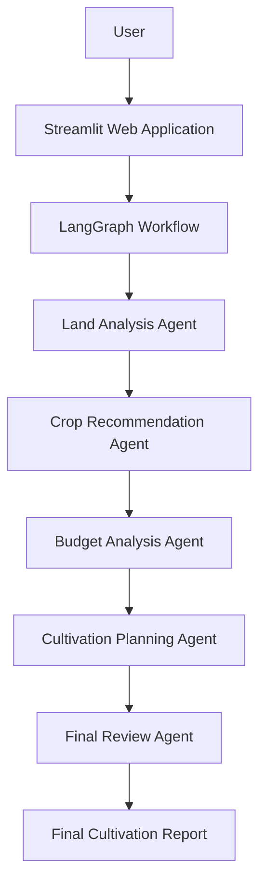
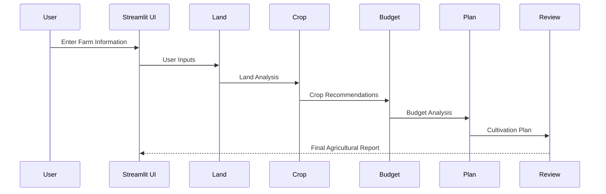
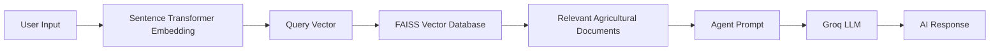
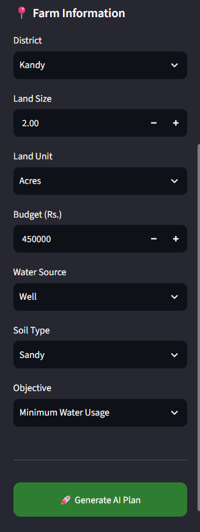
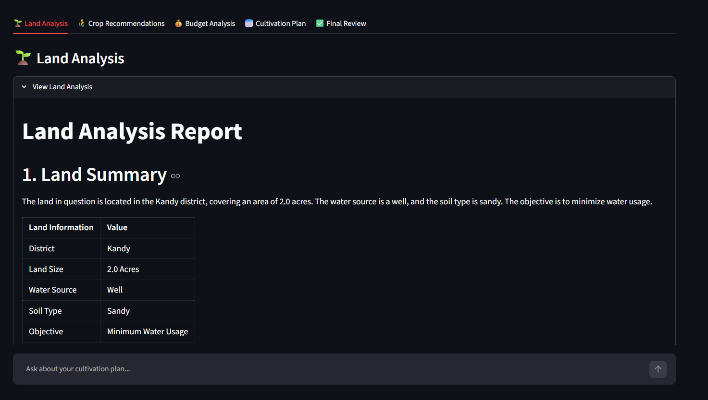
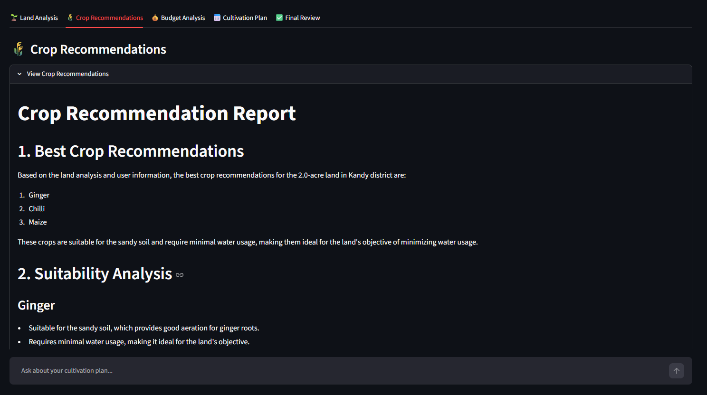
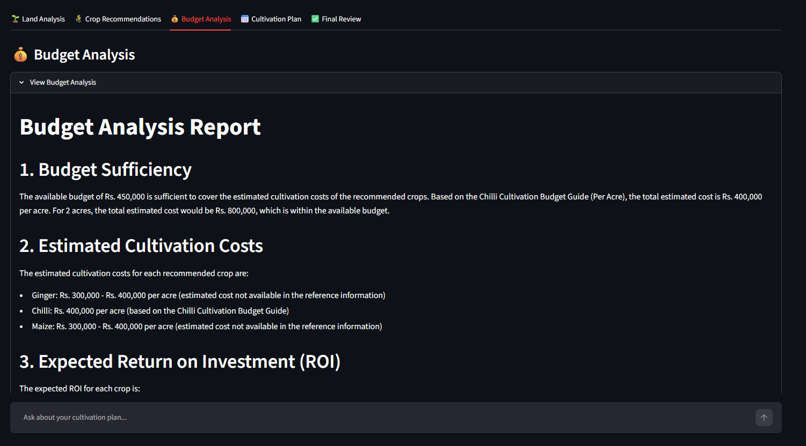
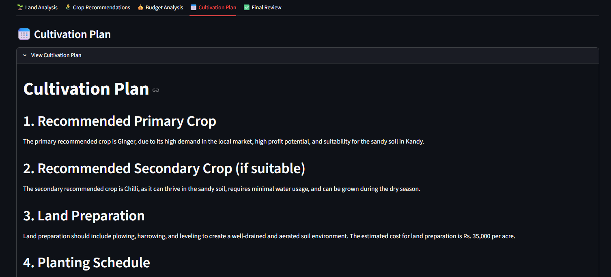
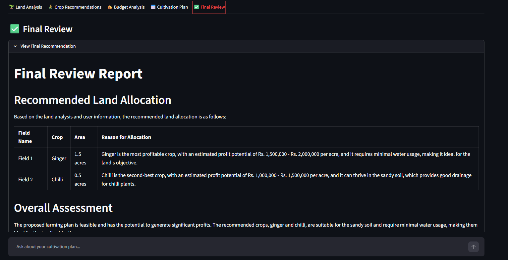
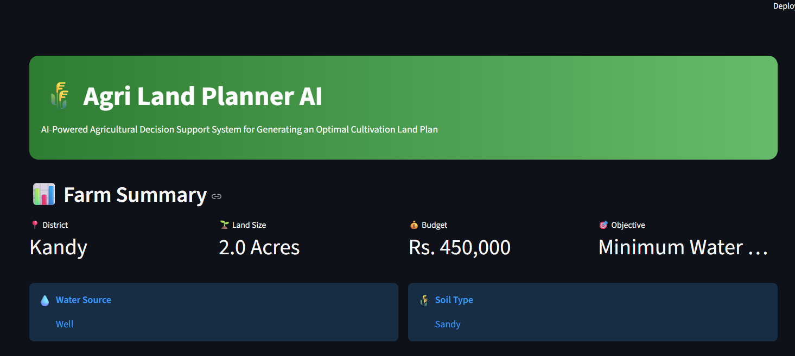

# 🌱 Agriculture Land Planning AI System

<p align="center">


</p>

---

# Agriculture Land Planning AI System

> **An AI-powered Multi-Agent Agricultural Decision Support System built using LangGraph, Retrieval-Augmented Generation (RAG), FAISS, and Groq Large Language Models.**

The **Agriculture Land Planning AI System** is an intelligent decision support application that helps farmers generate cultivation plans based on land characteristics, available budget, water source, soil type, and farming objectives.

Unlike traditional chatbot-based systems, this project follows a **Multi-Agent AI Architecture** implemented with **LangGraph**. Instead of solving the entire problem using a single prompt, the workflow is divided into specialized AI agents. Each agent performs one responsibility and passes its results to the next stage of the workflow.

To improve recommendation accuracy, the application integrates **Retrieval-Augmented Generation (RAG)**. Before generating responses, each AI agent retrieves relevant agricultural knowledge from a **FAISS Vector Database** built using **Sentence Transformer embeddings**. This enables recommendations to be grounded in agricultural documents rather than relying only on pretrained model knowledge.

The application uses **Groq-hosted Llama models** for high-speed inference and provides an easy-to-use **Streamlit** interface where users can enter farm information and receive an AI-generated cultivation plan.

---

# Table of Contents

- Project Overview
- Project Objectives
- Key Features
- System Architecture
- Agent Workflow
- RAG Pipeline
- Technology Stack
- Project Structure
- Installation Guide
- Environment Variables
- Running the Application
- Example Usage
- Screenshots
- Demo Video
- Live Demo
- GitHub Repository
- Known Limitations
- Future Improvements
- Acknowledgements
- Author
- License

---

# Project Overview

Agricultural planning requires evaluating multiple factors such as:

- District
- Land Size
- Soil Type
- Water Source
- Available Budget
- Farming Objective

Making these decisions manually can be difficult because recommendations depend on multiple conditions.

The **Agriculture Land Planning AI System** solves this problem using a collaborative **LangGraph Multi-Agent Workflow**.

Instead of asking one AI model to generate everything, the workflow divides the task into several specialized AI agents.

Each agent focuses on one responsibility:

- Land Analysis
- Crop Recommendation
- Budget Analysis
- Cultivation Planning
- Final Review

The workflow is coordinated using **LangGraph**, while **RAG** retrieves agricultural knowledge from a FAISS vector database before each agent generates its response.

The final result is a complete cultivation plan that includes land suitability analysis, crop recommendations, budget estimation, cultivation schedule, and a final expert review.

---

# Project Objectives

The objectives of this project are:

- Develop an AI-powered agricultural decision support system.
- Implement a Multi-Agent workflow using LangGraph.
- Improve recommendation quality using Retrieval-Augmented Generation (RAG).
- Build a searchable agricultural knowledge base using FAISS.
- Generate intelligent cultivation plans based on user inputs.
- Provide an easy-to-use Streamlit web interface.
- Demonstrate Agentic AI concepts through collaborative AI agents.
- Design a modular architecture that can be extended with additional AI agents in the future.

---

# Key Features

## Multi-Agent AI Workflow

The application divides the planning process into multiple specialized AI agents coordinated using LangGraph.

---

## Land Analysis Agent

Analyzes land suitability using:

- District
- Land Size
- Soil Type
- Water Source
- Farming Objective

---

## Crop Recommendation Agent

Recommends suitable crops using:

- Land analysis
- Agricultural knowledge base
- User objectives

---

## Budget Analysis Agent

Analyzes the available budget and provides:

- Estimated cultivation cost
- Budget allocation
- Financial recommendations

---

## Cultivation Planning Agent

Generates a cultivation schedule including:

- Land preparation
- Planting
- Irrigation
- Fertilization
- Harvesting

---

## Final Review Agent

Reviews all previous outputs and generates the final agricultural recommendation.

---

## Retrieval-Augmented Generation (RAG)

Each AI agent retrieves relevant agricultural documents before generating responses, improving recommendation accuracy and reducing hallucinations.

---

## Streamlit Web Application

A simple web interface allows users to enter agricultural information and receive AI-generated cultivation plans.

# System Architecture

The Agriculture Land Planning AI System follows a **Sequential Multi-Agent Architecture** implemented using **LangGraph**.

Each AI agent performs a specific task and passes its output to the next agent until a complete cultivation plan is generated.



---

# Architecture Explanation

The workflow begins when the user enters agricultural information through the Streamlit web interface.

The system then executes a sequence of AI agents using LangGraph.

Each agent is responsible for a single stage of the planning process.

The workflow consists of:

1. Land Analysis
2. Crop Recommendation
3. Budget Analysis
4. Cultivation Planning
5. Final Review

Each stage stores its results in the shared LangGraph state, allowing the next agent to use previous outputs when generating recommendations.

This modular design improves maintainability, scalability, and overall workflow organization.

---

# Agent Workflow

The following diagram illustrates how information flows through the system.



---

# Agent Responsibilities

| Agent | Responsibility |
|--------|----------------|
| Land Analysis Agent | Evaluates land suitability using district, soil type, water source, land size, and farming objective. |
| Crop Recommendation Agent | Recommends suitable crops based on land conditions and retrieved agricultural knowledge. |
| Budget Analysis Agent | Estimates cultivation costs and evaluates budget feasibility. |
| Cultivation Planning Agent | Generates a cultivation schedule including land preparation, planting, irrigation, fertilization, and harvesting. |
| Final Review Agent | Reviews all previous outputs and produces the final recommendation. |

---

# LangGraph Workflow

The LangGraph workflow executes the agents in the following order:

```text
Land Analysis
      │
      ▼
Crop Recommendation
      │
      ▼
Budget Analysis
      │
      ▼
Cultivation Planning
      │
      ▼
Final Review
      │
      ▼
END
```

This workflow ensures that every stage builds upon the results generated by previous agents.

---

# Retrieval-Augmented Generation (RAG)

The Agriculture Land Planning AI System integrates **Retrieval-Augmented Generation (RAG)** to improve the quality of AI-generated recommendations.

Instead of relying only on pretrained model knowledge, each AI agent retrieves relevant agricultural documents before generating its response.

The retrieved information provides reliable domain-specific knowledge that improves recommendation accuracy.

---

# RAG Pipeline



---

# RAG Processing Steps

### Step 1 – User Input

The user enters:

- District
- Land Size
- Land Unit
- Budget
- Water Source
- Soil Type
- Farming Objective

---

### Step 2 – Query Embedding

The user input is converted into vector embeddings using a Sentence Transformer model.

---

### Step 3 – Similarity Search

The generated vector is compared against the FAISS vector database to retrieve the most relevant agricultural documents.

---

### Step 4 – Context Retrieval

The retrieved documents are combined with the AI prompt before reasoning begins.

---

### Step 5 – AI Reasoning

The Groq-hosted language model analyzes:

- User Inputs
- Retrieved Agricultural Knowledge
- Previous Agent Outputs

---

### Step 6 – Response Generation

Each AI agent generates its response and passes it to the next stage of the workflow.

---

# Knowledge Base

The knowledge base contains agricultural information used by the RAG pipeline.

Examples include:

- Crop suitability
- Soil characteristics
- Water management
- Irrigation practices
- Fertilizer recommendations
- Pest and disease management
- Harvesting techniques
- Sustainable farming practices

The documents are converted into vector embeddings using Sentence Transformers and stored inside a FAISS Vector Database.

---

# Technology Stack

| Category | Technology |
|----------|------------|
| Programming Language | Python 3.11+ |
| Web Framework | Streamlit |
| Workflow Engine | LangGraph |
| AI Framework | LangChain |
| Large Language Model | Groq (Llama Models) |
| Vector Database | FAISS |
| Embedding Model | Sentence Transformers |
| Knowledge Retrieval | Retrieval-Augmented Generation (RAG) |
| Environment Variables | python-dotenv |
| Version Control | Git & GitHub |

# Project Structure

```text
AGRI-LAND-PLANNER-AI/
│
├── agents/
│   ├── budget_analysis.py
│   ├── crop_recommendation.py
│   ├── cultivation_plan.py
│   ├── land_analysis.py
│   ├── planning_assistant.py
│   └── review.py
│
├── docs/
│   └── screenshots/
│       ├── form.png
│       ├── land_analysis.png
│       ├── crop_recommendation.png
│       ├── budget_analysis.png
│       ├── cultivation_plan.png
│       ├── final_review.png
│       ├── farm_summary.png
│       └── assistant.png
│
├── graph/
│   ├── state.py
│   └── workflow.py
│
├── rag/
│   ├── data/
│   ├── vector_db/
│   ├── __init__.py
│   ├── build_vector_db.py
│   ├── embeddings.py
│   ├── loader.py
│   ├── rag_service.py
│   ├── retriever.py
│   ├── splitter.py
│   └── vector_store.py
│
├── tools/
│   ├── llm.py
│   └── search.py
│
├── ui/
│
├── .env
├── .gitignore
├── app.py
├── requirements.txt
└── README.md
```

---

# Why LangGraph?

The Agriculture Land Planning AI System uses **LangGraph** to manage a structured multi-agent workflow.

Instead of handling all reasoning in a single prompt, LangGraph coordinates multiple AI agents, where each agent performs a specific task and passes its results to the next stage.

### Advantages of LangGraph

- Supports multi-agent workflows
- Provides shared state management
- Enables sequential task execution
- Makes the workflow modular and scalable
- Simplifies maintenance and debugging
- Allows easy addition of new AI agents

LangGraph is responsible for coordinating the complete agricultural planning process from land analysis to the final review.

---

# Why Retrieval-Augmented Generation (RAG)?

Traditional language models generate responses using only their pretrained knowledge.

This project integrates **Retrieval-Augmented Generation (RAG)** so that each AI agent can retrieve relevant agricultural documents before generating recommendations.

The retrieved documents provide reliable domain-specific information that improves the quality and accuracy of responses.

### Benefits of RAG

- Improves recommendation accuracy
- Reduces hallucinations
- Uses agricultural knowledge instead of only pretrained knowledge
- Supports easy expansion of the knowledge base
- Enables semantic document retrieval using FAISS

---

# Installation Guide

Follow these steps to run the project locally.

## 1. Clone the Repository

```bash
git clone https://github.com/dilumgit/AGRI-LAND-PLANNER-AI.git

cd AGRI-LAND-PLANNER-AI
```

---

## 2. Create a Virtual Environment

### Windows

```bash
python -m venv venv

venv\Scripts\activate
```

### Linux / macOS

```bash
python3 -m venv venv

source venv/bin/activate
```

---

## 3. Install Required Packages

```bash
pip install -r requirements.txt
```

---

## 4. Configure Environment Variables

Create a file named **.env** in the project root.

Example:

```env
GROQ_API_KEY=your_groq_api_key
```

Replace the value with your own Groq API key.

---

## 5. Build the FAISS Vector Database

Before running the application, create the vector database.

```bash
python rag/build_vector_db.py
```

This command loads the agricultural documents, creates vector embeddings, and stores them inside the FAISS vector database.

---

## 6. Run the Application

```bash
streamlit run app.py
```

The Streamlit application will open automatically in your default web browser.

---

# Environment Variables

The project requires the following environment variable.

| Variable | Description |
|----------|-------------|
| GROQ_API_KEY | API key used to access Groq-hosted language models |

Example:

```env
GROQ_API_KEY=gsk_xxxxxxxxxxxxxxxxxxxxxxxxxxxxx
```

> **Important:** Never upload your `.env` file or API keys to a public GitHub repository.

---

# Running the Application

After completing the installation steps, start the application using:

```bash
streamlit run app.py
```

Once the application opens:

1. Select the **District**.
2. Enter the **Land Size**.
3. Select the **Land Unit**.
4. Enter the available **Budget**.
5. Select the **Water Source**.
6. Select the **Soil Type**.
7. Choose the **Cultivation Objective**.
8. Click **Generate Plan**.

The LangGraph workflow will automatically execute:

- Land Analysis Agent
- Crop Recommendation Agent
- Budget Analysis Agent
- Cultivation Planning Agent
- Final Review Agent

The generated report includes:

- Land Analysis
- Crop Recommendations
- Budget Analysis
- Cultivation Plan
- Final Review

---

# Example Usage

## Sample Input

| Field | Value |
|--------|-------|
| District | Kurunegala |
| Land Size | 2 |
| Unit | Acres |
| Budget | Rs. 500,000 |
| Water Source | Well |
| Soil Type | Loamy |
| Objective | Maximum Profit |

---

## AI Workflow

The application automatically performs the following steps:

1. Analyze the land characteristics.
2. Retrieve relevant agricultural knowledge using RAG.
3. Recommend suitable crops.
4. Analyze the available budget.
5. Generate a cultivation plan.
6. Review the generated recommendations.
7. Display the final cultivation report.

---

## Sample Output

The generated report includes:

- Land Analysis
- Crop Recommendations
- Budget Analysis
- Cultivation Plan
- Final Review

# Screenshots

## User Input Form

The user enters the required agricultural information, including district, land size, budget, water source, soil type, and cultivation objective.



---

## Land Analysis

The Land Analysis Agent evaluates the suitability of the land based on the provided information and retrieved agricultural knowledge.



---

## Crop Recommendations

The Crop Recommendation Agent recommends the most suitable crops for the selected land conditions.



---

## Budget Analysis

The Budget Analysis Agent estimates cultivation costs and evaluates whether the available budget is sufficient.



---

## Cultivation Plan

The Cultivation Planning Agent generates a complete cultivation schedule, including land preparation, planting, irrigation, fertilization, and harvesting activities.



---

## Final Review

The Final Review Agent reviews the recommendations generated by previous agents and produces the final cultivation report.



---

## Farm Summary

The final report provides a summarized view of the complete cultivation plan.



---

# Demo Video

A demonstration of the Agriculture Land Planning AI System is available at the following link:

**Demo Video:**

https://drive.google.com/file/d/1FqF0anl5RQA4GbKSipqRd52Skl0T9c9u/view?usp=sharing

---

# Live Streamlit Demo

Access the deployed application here:

https://YOUR_STREAMLIT_APP_URL.streamlit.app

> Replace the above URL with your actual Streamlit Community Cloud URL after deployment.

---

# GitHub Repository

Source code:

https://github.com/dilumgit/Agriculture-Land-Planning-Agent.git


---

# Known Limitations

The current version of the Agriculture Land Planning AI System has the following limitations:

- Recommendations depend on the quality of the agricultural knowledge base.
- The application does not currently use real-time weather information.
- Crop recommendations are limited to the available agricultural documents.
- Internet connectivity is required to access the Groq API.
- The system is intended as a decision-support tool and should not replace advice from agricultural experts.

---

# Future Improvements

Planned enhancements include:

- Integration with real-time weather APIs.
- Market price analysis for crop profitability.
- Multilingual support (English, Sinhala, and Tamil).
- Downloadable PDF cultivation reports.
- Image-based soil and crop analysis.
- Seasonal crop planning recommendations.
- Expanded agricultural knowledge base.
- Mobile-friendly user interface.

---

# Acknowledgements

This project was developed using the following open-source technologies:

- Python
- Streamlit
- LangGraph
- LangChain
- Groq
- FAISS
- Sentence Transformers

Special thanks to the open-source community for providing the tools and frameworks that made this project possible.

---

# Author

**Name:** Dilum Karunarathna

**Module:** IT41043 – Intelligent Systems

**Institution:** Horizon Campus

**GitHub:** https://github.com/dilumgit

**Email:** dilkaru999@gmail.com

---

# License

This project was developed for academic purposes as part of the **IT41043 – Intelligent Systems (Agentic AI)** module.

You are welcome to use, modify, and extend this project for educational and research purposes with appropriate attribution.

---

<p align="center">

## If you found this project useful, consider giving it a star on GitHub!

</p>